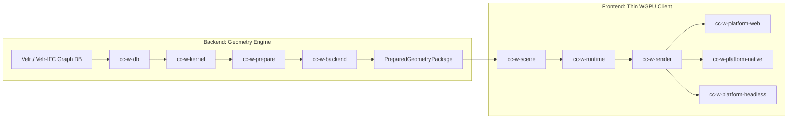

# W Architecture

## Purpose

This document defines the initial architecture for a Rust-first rendering stack that can serve as the foundation for:

- IFC/BIM style rendering
- STEP/CAD style rendering
- Web production deployment through WebAssembly + JavaScript bridge + WebGPU
- Native macOS/Linux execution for fast development iteration

The stack is designed around a strict separation between:

- exact or higher-order geometry processing on the CPU
- GPU rendering of prepared surfaces, edges, and triangulated assets
- a lightweight runtime scenegraph projection
- external property and relationship storage in a graph database backed by Velr and Velr-IFC

Naming convention:

- the engine itself is named `w`
- `cc` stands for Cartesian Coordinates
- workspace crates should use the `cc-w-*` prefix

## Design Principles

1. Exact geometry and rendering are different layers.
   Boolean operations, tessellation, healing, and analytic surface logic belong in the geometry kernel. The renderer consumes prepared drawables and should not own CAD math.

2. The web target is primary.
   Production architecture is centered on `wasm32-unknown-unknown` + `wgpu` + a thin JavaScript host. Native support exists to improve iteration speed and tooling.

3. Frontend and backend are separate architectural subsystems.
   The geometry engine lives on the backend side. The rendering client lives on the frontend side. Native development may compose both in one process, but web production should keep the split explicit.

4. Streaming is a core design constraint, even if eviction is not in v1.
   All geometry assets should have explicit loading and residency states so the engine can grow into streaming, culling-driven loading, and GPU eviction.

5. The runtime scenegraph is not the source of truth for metadata.
   IFC and STEP properties, classifications, and rich relationships remain in the external graph database. The in-memory scenegraph carries only runtime rendering state and references.

6. Geometry definition and geometry instance must be separate.
   This is essential for STEP assemblies, IFC type/product reuse, caching, and future streaming.

7. CPU precision and GPU precision are intentionally different.
   Use `f64` for kernel/domain transforms and `f32` for GPU submission, with camera-relative or local-origin rendering to avoid precision loss on large models.

8. Replaceable boundaries matter more than perfect first choices.
   The exact CAD kernel and STEP ingestion layer should be abstracted so they can evolve without forcing a renderer rewrite.

9. Internal world space is right-handed, Z-up, and metric.
   The engine should normalize incoming IFC, STEP, and authoring-space data into a shared world basis with `+X` right, `+Y` forward, `+Z` up, and `1.0 = 1 meter`.

10. State ownership must be explicit.
    App intent, renderer state, and database truth each have different owners. UI widgets should
    render from committed snapshots instead of keeping competing local truth. The detailed contract
    lives in [state-management.md](./state-management.md).

11. Station-based section views must be explicit.
    A station such as `120` is only meaningful when resolved through IFC alignment or linear
    placement facts. The section-state contract lives in
    [sections-and-stations.md](./sections-and-stations.md).

## Coordinate Frame

The internal engine coordinate frame is:

- right-handed
- `+X` = right
- `+Y` = forward
- `+Z` = up
- `1.0` world unit = `1 meter`

Implications:

- adapter and import layers are responsible for explicit axis and unit conversion at the boundary
- scenegraph, kernel, prepared assets, and renderer all operate in the same normalized world basis
- camera code should treat `+Z` as the preferred world-up axis, while still handling top-down views safely
- clip-space conversion remains backend-specific and happens after camera/view transforms

## Frontend / Backend Split

`w` should now be treated as two cooperating subsystems plus one shared boundary crate:

- shared boundary:
  - `cc-w-types`
  - transport-neutral IDs, primitive IR, tessellation requests, and prepared-package payloads
- backend:
  - `cc-w-db`
  - `cc-w-kernel`
  - `cc-w-prepare`
  - `cc-w-backend`
  - responsibility: talk to Velr, resolve geometry, perform booleans/healing/tessellation, and emit prepared geometry packages
- frontend:
  - `cc-w-scene`
  - `cc-w-runtime`
  - `cc-w-render`
  - platform shells
  - responsibility: stream prepared packages, build the active scene projection, cull, upload, and render

Production web rule:

- web clients should not depend on runtime tessellation as the normal path
- the frontend should receive prepared geometry packages from a backend service boundary
- any local frontend-side tessellation path should stay limited to tests, demos, and explicit fallback/debug workflows

Native rule:

- native/dev deployments may run frontend and backend in the same process for iteration speed
- that in-process composition is a deployment choice, not a license to collapse the architectural boundary

## Semantic Element Identity and Query-Driven Control

The viewer should be driven by semantic queries, not by raw draw-instance bookkeeping.

That means the prepared-package boundary needs two distinct identity layers:

- render-facing geometry definitions and geometry instances
- semantic element IDs and element metadata exposed to higher-level viewer control

The semantic element ID is the public identity used for:

- hide / unhide
- selection
- framing and centering
- future color overrides, x-ray modes, and heat maps
- query results coming back from Velr / OpenCypher / GraphQL

The important rule is:

- public viewer control must target stable source-carried semantic IDs
- it must not target package-local `GeometryInstanceId`
- it must not target transient database row order

For IFC-backed packages, the semantic element ID should be derived from the IFC identity carried by
the model itself. The default contract should use the raw `IfcProduct.GlobalId` string as-is:

```text
<GlobalId>
```

This is the ID that query-driven viewer tools should pass around. If a product has no `GlobalId`,
the fallback should be its source product id as a plain string, not a namespaced wrapper.

Why this matters:

- one IFC element may produce multiple body items and multiple render instances
- one semantic query should still address the element as one thing
- the viewer needs to preserve semantic intent even if tessellation strategy or instance packing changes

So the prepared package should explicitly carry:

- semantic element metadata entries
- a link from each prepared geometry instance back to its semantic element ID
- default render-class hints such as `physical`, `space`, `zone`, or `helper`

The frontend should keep a per-element state object layered on top of the prepared package. That
state object is where we will drive:

- visibility overrides
- selection state
- framing/centering targets
- later material overrides for analytical views

The browser REPL should talk to a small viewer API that accepts lists of semantic element IDs. The
browser should not reach into renderer internals directly.

Current status:

- the web viewer now keeps a runtime scene-state layer above the prepared package
- the browser exposes a small `window.wViewer` API for committed state snapshots and semantic
  element commands such as `viewState`, `defaultElementIds`, `hide`, `show`, `suppress`,
  `unsuppress`, `resetVisibility`, `select`, `clearSelection`, and `frameVisible`
- web state ownership is documented in [state-management.md](./state-management.md): app intent
  lives in the web shell, renderer truth lives in Rust runtime state, and rich semantic truth lives
  in Velr/IFC databases
- the browser REPL is now wired to that viewer API
- the local Rust web server now exposes `GET /api/resources` and `POST /api/package`
- when started through the Rust web server, the web viewer now lists both demo and IFC resources
- the web viewer now fetches prepared packages from the Rust server for IFC resources instead of
  pretending the browser can build them locally
- the local Rust web server now exposes `POST /api/cypher` for IFC resources
- the browser `queryCypher` / `queryIds` helpers now execute against that backend query surface
- the next semantic-control step is an AI terminal that is also mediated by the Rust server:
  read-only Cypher only, current-resource bound, and limited to a validated viewer action set
- the dedicated AI terminal contract and implementation plan live in
  [ai-agent-integration.md](./ai-agent-integration.md)
- the current web IFC path is dev-server scoped; production-grade streaming, incremental loading,
  and cache policy are still the next backend/frontend bridge to complete

Query execution should stay backend-side:

- the browser sends a query request to a backend service surface
- the backend executes against Velr / GraphQL
- the frontend receives rows or semantic IDs
- viewer operations then apply element-state overrides using those IDs

This keeps the frontend thin, keeps query policy centralized, and preserves the frontend/backend
split even when native dev runs both halves in one process.

## System Overview



## Proposed Workspace Layout

```text
cc-w/
  Cargo.toml
  docs/
    architecture.md
  crates/
    cc-w-types/
    cc-w-kernel/
    cc-w-prepare/
    cc-w-backend/
    cc-w-scene/
    cc-w-db/
    cc-w-render/
    cc-w-runtime/
    cc-w-platform-web/
    cc-w-platform-native/
    cc-w-platform-headless/
```

## Current Status Snapshot

As of `2026-04-19`, `w` has a working end-to-end polygonal mesh path, but it is still an engine scaffold rather than a full IFC/STEP renderer.

Related design note:

- `docs/frontend-backend-split.md` records the intended deployment and ownership split between the geometry backend and the thin rendering frontend.
- `docs/frontend-backend-migration-sweep.md` records the current migration sweep, lane ownership, and integration order for getting from the old in-process demo flow to the new split.
- `docs/velr-ifc-integration.md` records the data-system architecture for real IFC ingestion through `velr-ifc`, `velr`, and `velr-graphql`, including the first parallel implementation lanes for wiring that stack into `w`.
- `docs/ifc-reference-view-geometry.md` sketches the first IFC geometry support slice around IFC Reference View body geometry and mapped geometry.
- `docs/generic-geometry-primitives.md` defines the schema-neutral primitive families the engine core should use regardless of whether the source is IFC, STEP, or another adapter.
- `docs/tessellation-strategy.md` records the current kernel-first tessellation policy, candidate polygon triangulation strategy, and the line between CPU truth and later GPU optimization paths.
- `docs/ifc-rv-implementation-plan.md` tracks the current support status and the next implementation phases needed to reach meaningful IFC Reference View support.

Working today:

1. `cc-w-db` can produce normalized generic primitive demo resources and a repeated-instance demo resource, and it can normalize imported tessellated geometry, swept solids, circular sweeps, and instance transforms from declared source basis and source units into the internal `w` world frame.
2. `cc-w-kernel` can triangulate triangle and convex polygon face sets through a trivial primitive path, and the kernel boundary now carries a generic tessellation request envelope for future robust polygon and sweep work.
3. `cc-w-prepare` can convert a triangle mesh into a renderer-facing `PreparedMesh` with a local origin and flat normal data.
4. `cc-w-types` now includes a transport-neutral `PreparedGeometryPackage` boundary type for backend-to-frontend delivery.
5. `cc-w-backend` composes `cc-w-db`, `cc-w-kernel`, and `cc-w-prepare` into a backend-side package builder for the current demo flow.
6. `cc-w-runtime` now consumes prepared packages instead of directly depending on backend crates.
7. `cc-w-render` can upload and draw one shaded triangle mesh with `wgpu`, including offscreen rendering for tests.
8. `cc-w-platform-native` and `cc-w-platform-headless` now compose backend and frontend locally through the package boundary.
9. `cc-w-platform-web` builds for `wasm32`, but currently exposes only a minimal bootstrap/demo summary path instead of a real browser renderer.

Not done yet:

- polygon faces with holes and robust non-convex triangulation
- kernel tessellation for extrusion, revolve, and swept-disk primitives
- a real remote backend package/service path replacing the current local demo composition for web production
- repeated render submission and caching keyed by geometry definition plus tessellation settings
- real IFC and STEP adapter lowering into the generic primitive families

Not true yet:

- there is no real IFC adapter
- there is no real STEP adapter
- there is no Velr or Velr-IFC integration in the running code
- there is no exact geometry kernel, boolean path, or higher-order surface tessellation
- there is no production scenegraph projection from external data
- there is no streaming, demand loading, or eviction loop yet
- there is no picking or line pass yet
- the renderer currently supports only a minimal analytical shading path: per-instance model transforms, a camera world/view path, per-draw material color, a simple directional light, depth testing, and back-face culling
- there is not yet a richer style/material system for selection state, heat maps, x-ray, transparency policy, or line/edge overlays

## Crate Responsibilities

### Shared Boundary

#### `cc-w-types`

Shared domain-neutral types used across the workspace and across the frontend/backend boundary:

- stable IDs and handles
- bounds and transform wrappers
- source-space metadata such as handedness, axis basis, and length unit
- asset residency state
- tessellation request/response envelopes
- generic primitive IR
- prepared-package payloads such as `PreparedGeometryPackage`
- error enums that are safe to share across crate boundaries

This crate should stay small and dependency-light to avoid cycles.

### Backend

### `cc-w-kernel`

The CPU-side geometry kernel. Responsibilities:

- analytic primitives and higher-order geometry
- B-Rep or equivalent exact geometry representation
- boolean operations
- surface/curve evaluation
- tessellation into renderable payloads
- geometry healing/normalization as needed
- precise bounds in model space

This crate should operate in `f64` and should not depend on `wgpu`.

The first implementation can evaluate Rust-native options such as `truck-modeling` and `truck-shapeops`, but the crate boundary should hide that decision from the rest of the system.

### `cc-w-prepare`

Converts kernel output into renderer-friendly assets:

- indexed triangle buffers
- edge/line buffers
- draw ranges and chunk descriptors
- local origins for precision management
- bounding volumes per chunk
- picking IDs and feature IDs
- cache keys for tessellation tolerance and display modes

This layer is where exact geometry becomes prepared geometry.

### `cc-w-backend`

Backend-side orchestration over repository, kernel, and prepare:

- resolve requested geometry resources
- tessellate and prepare them
- assemble transport-neutral `PreparedGeometryPackage` values
- provide one backend seam that native/dev can call locally and web production can later expose through a service boundary

The primary in-process entrypoint here should read as `GeometryBackend`.

This crate should stay on the backend side of the split and should not depend on frontend runtime/render code.

### Frontend

#### `cc-w-scene`

Owns the in-memory runtime scenegraph projection:

- parent/child relationships for the active runtime view
- instance transforms
- geometry definition references
- material/style references
- visibility flags
- selection/highlight state
- per-node bounds
- residency and load intent

It must not become a metadata mirror of IFC or STEP. Rich properties remain in the DB layer and are queried on demand.

### Backend (continued)

### `cc-w-db`

Adapter layer for Velr / Velr-IFC:

- transport-agnostic repository traits for scene and property access
- database queries for graph projection
- lookup of geometry definitions and topology references
- property retrieval on demand
- loading of assembly/product structure
- conversion from external IDs to engine IDs
- axis, handedness, and unit normalization at the import boundary
- cache and connection management

For architecture purposes, this crate should separate API shape from transport:

- native/dev paths may use a direct Velr-backed adapter
- web production paths should use a remote service boundary instead of linking browser code to a native DB runtime

The render engine should talk to the database through this crate, not through raw Velr calls spread across the codebase.

Imported geometry should leave this crate already normalized into the internal `w` frame. Future IFC and STEP adapters should perform explicit basis conversion here instead of letting axis assumptions leak into kernel, scene, or render code.
The import payload should also preserve source metadata per file or per document, so debugging, export, and adapter behavior can still see the original basis and units after normalization.
Adapters should target a small import envelope API here, filling in source-space metadata, geometry, and local transform, then let the crate normalize into a world-native import payload before lowering to generic geometry resources.

### Frontend (continued)

#### `cc-w-render`

The rendering backend on top of `wgpu`:

- device/surface management
- shader pipeline creation
- GPU buffer and texture allocation
- upload staging
- render passes
- draw submission
- picking pass
- optional line/edge pass
- material binding model

This crate consumes prepared assets and view data. It should not know about IFC or STEP semantics.
Named rendering profiles such as `diffuse`, `bim`, and `architectural` are owned here; the profile
contract and implementation plan live in [rendering-profiles.md](./rendering-profiles.md).

#### `cc-w-runtime`

The orchestration layer:

- frame scheduling
- async job coordination
- scene updates
- culling
- asset load queue management
- coordination between prepared-package sources, scene state, and render crates
- event translation between platform shells and engine systems

This is the glue layer that turns the crates into a running engine.

#### `cc-w-platform-web`

The web shell:

- `wasm-bindgen` and `web-sys` bindings
- JavaScript bridge for canvas and browser lifecycle
- input plumbing
- optional browser fetch integration
- future worker integration for background tasks

The JavaScript layer should be thin and coarse-grained. Avoid per-draw-call or per-object JS/Rust chatter.

#### `cc-w-platform-native`

The native shell for macOS/Linux:

- `winit` window/event loop integration
- native surface creation for `wgpu`
- input and resize plumbing
- local file loading for development
- debug overlays or profiling hooks later

This target exists primarily to speed up development and debugging, not to fork the engine architecture.

#### `cc-w-platform-headless`

The headless shell for automated rendering and regression checks:

- offscreen `wgpu` rendering without a window surface
- CLI-driven selection of resource, camera, viewport, and output path
- PNG dump path for renderer smoke tests and future snapshot comparisons
- shared runtime and renderer code with the interactive targets

This crate should stay thin and exist to verify the rendering path, not to introduce a separate execution model.

## Current Crate Status

This section describes the current implementation state, not just the target architecture.

### `cc-w-types`

Status: usable foundation.

Implemented:

- external IDs
- bounds and geometry validation
- convex polygon and triangle mesh containers
- prepared mesh and prepared vertex payloads
- residency states used by the scene/runtime scaffold
- explicit world-frame definitions
- source-space and import metadata for basis/unit normalization

Still missing:

- richer geometry definition types
- line/edge payload types
- picking/feature ID payloads
- draw chunk descriptors
- stronger typed IDs for definition/instance separation

### `cc-w-kernel`

Status: stub.

Implemented:

- a narrow `GeometryKernel` trait
- `TrivialKernel`, which triangulates convex polygons by emitting a triangle fan

Still missing:

- exact solids and surfaces
- boolean operations
- surface evaluation
- robust tessellation controls
- non-convex handling
- kernel abstraction over a real CAD backend

### `cc-w-prepare`

Status: narrow but real.

Implemented:

- conversion from `TriangleMesh` to `PreparedMesh`
- local-origin recentering for precision
- flat normal generation from the first triangle

Still missing:

- chunking
- edge extraction
- feature/picking IDs
- material/style preparation
- multiple display modes
- cache keys based on tessellation/display settings

### `cc-w-backend`

Status: new but real.

Implemented:

- backend orchestration over repository, kernel, and prepare
- package building for the current demo resource flow
- repeated-instance package generation for the mapped demo resource

Still missing:

- multi-definition package assembly
- scene/projection payload beyond flat prepared instances
- remote service exposure for web production
- package caching and chunking

### `cc-w-scene`

Status: minimal runtime scaffold.

Implemented:

- root node creation
- parent/child links
- mesh-instance insertion
- per-node transform, bounds, and residency storage

Still missing:

- geometry definition vs instance split in the runtime model
- material/style references
- visibility and selection state management
- scene projection updates from DB queries
- traversal helpers, culling structures, and mutation workflows

### `cc-w-db`

Status: backend import/query scaffold with demo data only.

Implemented:

- a repository trait used by the current backend demo path
- an in-memory demo repository
- imported polygon envelope types for future adapters
- explicit normalization from source basis/unit into `w` world space
- preservation of original source-space metadata after normalization

Still missing:

- Velr integration
- Velr-IFC integration
- transport-neutral service/client split for web production
- geometry definition lookup from real external data
- property queries
- projection queries for IFC or STEP assemblies

### `cc-w-render`

Status: real but intentionally tiny frontend renderer.

Implemented:

- `wgpu` mesh pipeline with a single shaded triangle pass
- camera model aligned to right-handed Z-up world space
- prepared mesh upload
- prepared scene upload with reusable geometry definitions plus instanced draw batches per definition
- per-instance model matrix carried separately from mesh data
- camera clip/view composition kept in `f64` on the CPU side before `f32` GPU upload
- current instanced normal handling assumes rigid-body or uniform-scale instance transforms
- native render pass
- depth buffering and back-face culling
- simple diffuse directional lighting
- per-draw material color bound in the fragment stage
- offscreen render-to-image path with readback

Still missing:

- picking
- edge/line rendering
- larger-scale submission compaction across many definitions, plus dynamic instance streaming/update policy
- richer analytical display styles such as selection tint, heat maps, x-ray, and transparency control
- render graph or multipass structure
- culling-aware submission

### `cc-w-runtime`

Status: frontend orchestration stub with package consumption.

Implemented:

- a simple engine wiring prepared-package source, scene, and renderer traits together
- synchronous demo asset construction
- synchronous demo frame/upload construction

Still missing:

- async job orchestration
- culling
- streaming-aware load queues
- scene update pipeline from richer projection/package data
- separation between geometry definitions, instances, and GPU residency
- event/system architecture

### `cc-w-platform-web`

Status: placeholder shell.

Implemented:

- `wasm-bindgen` entry points
- a minimal demo summary path that proves the workspace can build for web

Still missing:

- canvas acquisition
- WebGPU surface setup
- browser event plumbing
- JS host contract for production embedding
- real rendering output in the browser

### `cc-w-platform-native`

Status: usable development shell.

Implemented:

- `winit` event loop
- native `wgpu` surface creation
- resize handling
- demo mesh upload and draw loop

Still missing:

- camera controls
- resource selection from CLI or UI
- overlays/debug tooling
- richer scene loading

### `cc-w-platform-headless`

Status: useful verification shell.

Implemented:

- CLI resource selection
- camera override arguments
- offscreen rendering to PNG
- snapshot comparison helpers and golden-image tests

Still missing:

- batch rendering
- richer fixture discovery
- tolerance profiles per test case
- CI-oriented reporting/output conventions

## Dependency Rules

The intended dependency direction is:

```text
cc-w-types
  ^    ^     ^      ^       ^
  |    |     |      |       |
cc-w-kernel  cc-w-scene cc-w-db cc-w-render
      ^        ^      ^      ^
      |        |      |      |
          cc-w-prepare
               ^
               |
           cc-w-runtime
            ^      ^
            |      |
  cc-w-platform-web  cc-w-platform-native  cc-w-platform-headless
```

Rules:

- `cc-w-kernel` must not depend on `cc-w-render`.
- `cc-w-render` must not depend on `cc-w-db`.
- `cc-w-scene` must not own rich property payloads from IFC/STEP.
- platform crates should be thin wrappers around `cc-w-runtime`.
- exact geometry types should not leak directly into the renderer.

## Core Runtime Data Model

### Scene Node

Each runtime node should carry only the data needed for traversal, culling, and draw submission:

- `node_id`
- `external_id`
- `parent`
- `children`
- `local_transform_f64`
- `world_bounds_f64`
- `geometry_instance_ref`
- `material_ref`
- `visibility_state`
- `selection_state`
- `residency_state`

### Geometry Definition vs Instance

Geometry definitions are reusable, immutable payload sources:

- parametric solid definition
- B-Rep definition
- triangulated static asset
- metadata needed for tessellation or loading

Geometry instances are cheap references:

- transform
- style override
- visibility override
- external ID linkage
- scene ownership

This split must exist from day one.

### Prepared Asset

A prepared asset is the renderer-facing output of kernel and prepare steps:

- triangle vertex buffer payload
- triangle index buffer payload
- line/edge payload
- chunk bounds
- local origin
- draw ranges
- feature ID / picking ID mapping
- display mode compatibility flags

## Scenegraph Strategy

The scenegraph should be treated as a projection, not a canonical schema.

That matters because:

- IFC is graph-like and may have multiple useful runtime projections
- STEP assemblies are naturally definition/instance oriented
- the DB may expose relationships that should not all appear in traversal

Recommended approach:

1. Use the DB as the source of truth for rich relationships and properties.
2. Build one runtime projection at a time for rendering and interaction.
3. Keep projection creation cheap enough to rebuild or patch incrementally.

Possible runtime projections include:

- assembly tree
- spatial containment tree
- filtered view for a discipline or layer
- exploded or temporary editing view

## Geometry Pipeline

The geometry path should be split into backend and frontend phases.

Backend:

1. Query geometry metadata or definition references from `cc-w-db`.
2. Load or resolve a geometry definition.
3. Run kernel operations in `cc-w-kernel`.
4. Tessellate into exact intermediate output.
5. Convert to prepared chunks in `cc-w-prepare`.
6. Emit a `PreparedGeometryPackage`.

Frontend:

1. Request or stream a `PreparedGeometryPackage`.
2. Project package data into the active runtime scene.
3. Upload prepared assets to GPU memory through `cc-w-render`.
4. Attach GPU residency to scene instances through `cc-w-runtime`.
5. Submit draws.

The kernel should be able to support both:

- authored triangulated assets
- higher-order surfaces and solids that need tessellation

## Rendering Model

### Backend

Use `wgpu` as the graphics abstraction for both:

- WebGPU in browsers
- native Metal/Vulkan backends during development

### Precision

Use:

- `f64` in kernel/domain math
- `f32` in prepared GPU payloads
- camera-relative or local-origin transforms during submission

This avoids unstable rendering on large BIM/CAD coordinates while keeping GPU buffers practical.

### v1 Rendering Features

Version 1 should focus on:

- opaque shaded triangle rendering
- optional edge/line overlay path
- named rendering profiles for baseline and architectural linework experiments
- object and feature picking
- frustum culling
- async CPU-to-GPU upload
- stable IDs for selection and inspection
- analytical display control over photoreal material richness

For `w`, that means simple property colors and fast style overrides matter more than realistic BRDF work. Selection color changes, heat maps, x-ray-style display, and similar intelligence-oriented views should shape the display model before any photoreal expansion.

Version 1 should not depend on:

- full streaming eviction
- occlusion culling
- advanced hidden-line rendering
- interactive boolean editing tools
- highly dynamic material systems

## Streaming and Residency Model

Streaming is not required to be complete in v1, but the architecture should be built around it.

Recommended asset state machine:

```text
Unloaded
  -> MetadataReady
  -> CpuReady
  -> GpuReady
  -> Resident
  -> Evictable
```

For v1:

- implement loading and residency tracking
- support deferred upload
- support culling-aware load requests
- do not implement aggressive eviction yet

For later versions:

- add GPU eviction
- add memory budgeting
- add chunk-level prioritization
- add occlusion-aware demand loading
- add spatial or hierarchical streaming groups

### Streaming Unit

The recommended streaming unit is a geometry definition chunk, not a scene node.

Reasons:

- many nodes may instance the same geometry
- upload and tessellation caches become reusable
- assembly trees should not dictate asset granularity

## Database Integration

Velr / Velr-IFC should be used as the external data authority for:

- graph relationships
- IFC properties
- assembly structure
- classifications and metadata
- external identifiers

The in-memory engine should only cache what is needed for runtime performance.

Guidelines:

- isolate connection and query concerns inside `cc-w-db`
- avoid direct property storage on scene nodes
- resolve properties lazily for inspection/UI
- cache immutable or slow-to-fetch data near the DB boundary
- keep the engine-facing repository API independent from the concrete transport
- assume web clients will talk to a service endpoint rather than embedding a native Velr runtime

Practical note:

- native tools and development shells can use a direct Velr adapter
- browser deployments should consume DB data through a remote API shaped around scene projection, geometry definition lookup, and property queries
- keep query semantics and result mapping isolated, since the current Velr API and feature surface are still evolving

## Math and Utility Crates

Recommended foundational crates:

- `glam` for vector and matrix math
- `wgpu` for rendering
- `winit` for native shell/windowing
- `wasm-bindgen`, `web-sys`, and `js-sys` for web integration
- `bytemuck` for buffer-safe POD transfers
- `slotmap` or typed handle patterns for stable in-memory IDs
- `smallvec` for traversal-friendly small collections
- `thiserror` for shared error handling

Math guidance:

- prefer `DVec*` / `DMat*` in kernel and domain transforms
- prefer `Vec*` / `Mat*` in render submission
- avoid mixing precision accidentally across crate boundaries
- keep `glam` as the only first-party vector/matrix math library across frontend, backend, kernel, and shared types
- depend on `glam.workspace = true` in crate manifests instead of pinning local `glam` versions or introducing parallel math stacks

## Core Trait Boundaries

These are not final APIs, but they are the right architectural seams.

```rust
pub trait GeometryKernel {
    type Solid;
    type Surface;

    fn tessellate(
        &self,
        def: &GeometryDefinition,
        request: &TessellationRequest,
    ) -> Result<TessellationOutput, KernelError>;

    fn boolean(
        &self,
        op: BooleanOp,
        lhs: &Self::Solid,
        rhs: &Self::Solid,
    ) -> Result<Self::Solid, KernelError>;
}
```

```rust
pub trait GeometryRepository {
    fn definition(&self, id: GeometryDefId) -> Result<GeometryDefinition, DbError>;
}
```

```rust
pub trait PropertyRepository {
    fn properties(&self, external_id: ExternalId) -> Result<PropertySet, DbError>;
}
```

```rust
pub trait PreparePipeline {
    fn prepare(
        &self,
        output: TessellationOutput,
        request: &PrepareRequest,
    ) -> Result<PreparedAsset, PrepareError>;
}
```

```rust
pub trait RenderBackend {
    fn upload(&mut self, asset: &PreparedAsset) -> Result<GpuAssetHandle, RenderError>;
    fn render(&mut self, frame: &RenderFrame) -> Result<(), RenderError>;
}
```

```rust
pub trait SceneProjectionSource {
    fn load_projection(&self, root: ExternalId) -> Result<SceneProjection, DbError>;
}
```

## JavaScript Bridge Strategy

The JavaScript bridge should stay intentionally thin.

JavaScript should handle:

- canvas acquisition
- browser lifecycle hooks
- top-level app bootstrap
- optional fetch or worker glue

Rust should handle:

- frontend scene state
- culling
- scheduling
- render submission

Backend Rust should handle:

- geometry preparation
- tessellation and booleans
- package building
- DB-side projection and lookup workflows

Avoid designs where JavaScript mirrors scene objects, participates in per-frame object traversal, or becomes the place where production geometry processing lives.

## Concurrency Notes

The architecture should support background work, but the initial implementation should not assume that every target can use the same threading model.

Guidance:

- keep render submission single-owner
- design tessellation and prepare steps to be job-friendly
- isolate platform-specific threading details in `cc-w-runtime` and platform crates
- do not make the kernel API depend on browser threading assumptions

## Versioning Strategy

### v1.0

Deliver:

- Rust workspace with the crate boundaries above
- native + web shells
- `wgpu` renderer
- scenegraph projection
- DB-backed metadata/property lookup
- definition/instance model
- CPU tessellation path
- prepared mesh upload path
- frustum culling
- picking

Defer:

- full asset eviction
- occlusion culling
- advanced hidden-line and technical illustration modes
- collaborative editing
- runtime boolean authoring workflows

### v1.1+

Expand into:

- streaming eviction and memory budgets
- chunk prioritization
- worker-based preparation
- section planes and clipping workflows
- multiple render modes
- better edge extraction and hidden-line rendering
- geometry healing and import robustness improvements

## Key Risks and Open Decisions

1. Exact geometry kernel maturity.
   Rust-native exact CAD tooling is improving, but this boundary should stay swappable until the best long-term kernel path is proven.

2. STEP ingestion path.
   Treat STEP import as a replaceable adapter concern instead of anchoring the whole design to a single early library choice.

3. IFC projection shape.
   The runtime scenegraph must stay projection-based so it can support multiple useful IFC views without duplicating the full DB graph in memory.

4. Browser execution model.
   Web deployment constraints should not leak backward into the core geometry abstractions.

5. DB transport split.
   Because the production web client should treat Velr as an external system rather than an in-browser runtime dependency, the repository API needs to stay transport-neutral from the start.

## Recommended First Build Order

1. Create the workspace and crate boundaries exactly once, before feature work spreads.
2. Implement `cc-w-types`, `cc-w-scene`, and `cc-w-render` with a simple triangle test path.
3. Add `cc-w-platform-native` first for tight iteration.
4. Add `cc-w-platform-web` with the same runtime contract.
5. Introduce `cc-w-db` and a scene projection from Velr/Velr-IFC.
6. Introduce `cc-w-kernel` and `cc-w-prepare` behind traits, even if the first implementation is narrow.
7. Add async loading, residency state, and culling-aware demand logic.

## Progress Against First Build Order

As of `2026-04-19`:

1. Workspace and crate boundaries are in place.
2. The simple triangle/polygon test path is implemented across `cc-w-types`, `cc-w-kernel`, `cc-w-prepare`, `cc-w-runtime`, and `cc-w-render`.
3. `cc-w-platform-native` exists and can render the demo asset.
4. `cc-w-platform-web` exists as a buildable shell, but not as a real browser renderer yet.
5. `cc-w-db` exists only as an in-memory/demo import boundary. Velr is intentionally not wired yet.
6. `cc-w-kernel` and `cc-w-prepare` exist behind traits, but both are narrow scaffolds rather than production geometry systems.
7. Async loading, demand-driven residency, and culling-aware orchestration have not started yet.

## Immediate Next Steps

The next meaningful build steps should be:

1. introduce a real geometry-definition model separate from scene instances
2. add a real scene projection API in `cc-w-db`, still without forcing Velr wiring immediately
3. replace the convex-polygon-only kernel path with a more realistic imported mesh/tessellation path
4. make `cc-w-platform-web` render to a browser canvas instead of only exposing a summary string
5. add camera controls and multi-resource selection in the native shell
6. introduce culling and a basic residency/load-intent loop in `cc-w-runtime`
7. decide the first real adapter milestone: IFC-first or STEP-first

## Summary

The architecture should center on a Rust `wgpu` renderer fed by a precise CPU-side geometry kernel, with a lightweight projection scenegraph and a DB-backed metadata model.

The most important early decisions are:

- separate exact geometry from rendering
- separate geometry definitions from instances
- keep the scenegraph runtime-only
- design all assets with future streaming in mind
- make web the primary target without forking the engine model from native development
