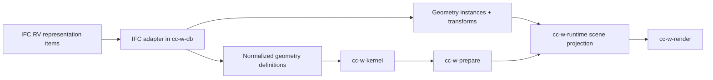

# IFC Reference View Geometry Strategy

## Scope

This document narrows the first IFC geometry milestone for `w` to the geometry concepts used by IFC Reference View.

For this pass, "IFC Reference View" means:

- IFC4 Reference View `ReferenceView_V1-2` from buildingSMART
- cross-checked against IFC4.3.2 official concept and lexical documentation where entity semantics are clearer

The goal is not to support every IFC geometry form. The goal is to support the compact, common, render-oriented geometry subset first, and make that subset the foundation for later IFC and STEP work.

## Why Start Here

Reference View is a good first target because it deliberately restricts geometry variety for receiving applications. That makes it a strong fit for `w`, where we want:

- predictable import behavior
- shared geometry definitions and instances
- a clean path from imported geometry to prepared render assets
- a future-proof kernel boundary without needing full design-transfer semantics on day one

## What IFC Reference View Actually Gives Us

For primary 3D body geometry, IFC4 Reference View centers on four practical cases:

1. `Body` `Tessellation`
   - `IfcTessellatedFaceSet`
   - in practice: `IfcTriangulatedFaceSet` and `IfcPolygonalFaceSet`
2. `Body` `SweptSolid`
   - `IfcExtrudedAreaSolid`
   - `IfcRevolvedAreaSolid`
3. `Body` `AdvancedSweptSolid`
   - in practical RV scope, this is the `IfcSweptDiskSolid` path
4. `MappedRepresentation`
   - `IfcMappedItem` + `IfcRepresentationMap`
   - the mapped representation still has to obey the same RV body-geometry constraints

There are also useful auxiliary representations:

- `FootPrint`
- `Box`
- `CoG`
- `Reference`

Those matter, but they should not define the main body-render path.

## Working Support Tiers

### Tier 1: Required for the first real IFC RV importer

- `IfcTriangulatedFaceSet`
- `IfcPolygonalFaceSet`
- `IfcExtrudedAreaSolid`
- `IfcRevolvedAreaSolid`
- `IfcSweptDiskSolid`
- `IfcMappedItem`
- `IfcLocalPlacement` / representation-local placements

### Tier 2: Parse and keep, but do not make them blockers for shaded body rendering

- `FootPrint` geometry
- `Box` geometry
- `CoG` geometry
- `Reference` geometry

### Tier 3: Explicitly deferred

These are not the target of the first RV geometry milestone:

- CSG / boolean result trees
- BRep / AdvancedBRep workflows
- design-transfer parametric editing semantics
- general freeform curves and surfaces outside the RV swept/tessellated subset

This deferment is an inference from the IFC4 Reference View concept scope, which explicitly centers RV body geometry on tessellation, swept solids, advanced swept disk solids, and mapped geometry rather than the broader IFC geometry model.

## Proposed Internal Geometry Model

The key architectural choice is this:

- normalize units and axes at the IFC adapter boundary
- keep reusable geometry in normalized local definition space
- keep transforms separate as instances
- only triangulate when the geometry type requires it or when the render path requests it

That leads to a geometry-definition model like this:

```rust
enum GeometryDefinitionKind {
    TessellatedFaceSet(TessellatedFaceSetDef),
    SweptSolid(SweptSolidDef),
    SweptDisk(SweptDiskSolidDef),
}

struct GeometryDefinition {
    id: GeometryDefId,
    source_space: SourceSpace,
    local_bounds: Bounds3,
    kind: GeometryDefinitionKind,
    auxiliary: Vec<AuxiliaryRepresentation>,
}

struct GeometryInstance {
    definition: GeometryDefId,
    world_from_instance: DMat4,
    style: Option<StyleRef>,
    external_id: ExternalId,
}

enum AuxiliaryRepresentation {
    FootPrint(FootPrintDef),
    Box(BoundingBoxDef),
    CenterOfGravity(DVec3),
    Reference(ReferenceGeometryDef),
}
```

This is not the final Rust API. It is the shape we should design toward.

## Curves and Profiles We Should Normalize Around

To support RV swept geometry cleanly, the kernel boundary should not take raw IFC classes directly. It should take a normalized curve/profile model.

Recommended first curve/profile IR:

```rust
enum Curve2Segment {
    Line { to: DVec2 },
    Arc {
        to: DVec2,
        center: DVec2,
        ccw: bool,
    },
}

struct PolyCurve2 {
    start: DVec2,
    segments: Vec<Curve2Segment>,
    closed: bool,
}

struct Profile2 {
    outer: PolyCurve2,
    holes: Vec<PolyCurve2>,
}

enum Curve3Segment {
    Line { to: DVec3 },
    Arc {
        to: DVec3,
        center: DVec3,
        normal: DVec3,
        ccw: bool,
    },
}
```

Why this matters:

- RV polycurve profiles are a common path for `IfcExtrudedAreaSolid` and `IfcRevolvedAreaSolid`
- RV swept disk geometry commonly uses `IfcIndexedPolyCurve` as the directrix
- this IR is small enough to build now, but rich enough to preserve arcs instead of flattening everything too early

Parameterized IFC profiles can later be lowered into the same `Profile2` IR without changing the rest of the pipeline.

## Kernel to Render Pipeline



The adapter should do:

- resolve placement chains
- normalize source basis and units into `w`
- extract a reusable geometry definition
- extract instance transforms separately
- preserve auxiliary representations and source metadata

The kernel should do:

- geometry validation
- analytic-to-mesh tessellation where needed
- polygon triangulation where needed
- optional later healing and boolean operations

The prepare stage should do:

- convert triangle output into `PreparedMesh`
- choose local origins
- split future chunks
- compute or preserve normals
- assign future feature/style metadata

The renderer should do:

- triangle draw submission
- future line/edge overlay
- future instancing for mapped geometry reuse

## Handling by Geometry Type

### 1. `IfcTriangulatedFaceSet`

This is the straightest path into `w`.

Adapter:

- parse the point list and index arrays
- apply source-space normalization
- convert one-based IFC indices to zero-based internal indices
- preserve optional normals and optional per-face color linkage if present

Kernel:

- mostly validate and normalize winding/closure metadata
- treat this as mesh-native input, not as an analytic solid

Prepare:

- keep triangle topology
- compute normals only if IFC data does not provide good normals
- choose local origin and bounds

Render:

- direct triangle rendering

Recommendation:

- make this the first IFC RV geometry path we implement

### 2. `IfcPolygonalFaceSet`

This is still mesh-like, but it needs polygon handling.

Adapter:

- parse polygon faces and optional inner loops
- normalize coordinates into `w`

Kernel:

- triangulate polygons
- triangulate polygon faces with voids
- validate planarity and winding

Prepare:

- same output shape as any other triangle mesh

Render:

- identical to the triangulated path after kernel processing

Recommendation:

- implement immediately after `IfcTriangulatedFaceSet`

### 3. `IfcExtrudedAreaSolid`

This is the first analytic RV solid we should support.

Adapter:

- lower the swept profile into `Profile2`
- keep the extrusion depth, direction, and local item placement
- normalize units and basis, but do not bake away definition reuse

Kernel:

- validate the profile loops
- tessellate top, bottom, and side walls from the analytic definition
- keep tolerance-based tessellation controls

Prepare:

- convert to `PreparedMesh`
- optionally derive edge data later from profile and side topology

Render:

- standard shaded triangle path

Recommendation:

- this should be the first analytic solid implemented after tessellation support

### 4. `IfcRevolvedAreaSolid`

This is the second analytic RV solid.

Adapter:

- lower the profile into `Profile2`
- preserve revolution axis, angle, and local placement

Kernel:

- tessellate adaptively based on sweep angle, radius, and tolerance
- treat caps and side surfaces explicitly

Prepare:

- same output contract as other triangle-producing paths

Render:

- standard shaded triangle path

Recommendation:

- implement after extrusion, since it uses the same profile infrastructure

### 5. `IfcSweptDiskSolid`

This is the RV advanced swept solid path, and it is especially important for reinforcing elements.

Adapter:

- parse the directrix into a normalized 3D curve form
- preserve radius, optional inner radius, and optional start/end trims

Kernel:

- generate a tube or annular tube along the directrix
- handle mitering or join behavior consistently
- tessellate adaptively by curvature and radius

Prepare:

- emit a regular triangle mesh
- later, optionally preserve centerline data for selection or overlays

Render:

- standard shaded triangle path

Recommendation:

- implement after extrusion and revolution, but before deeper IFC element coverage

### 6. `IfcMappedItem`

Mapped geometry is not a separate body primitive. It is how IFC RV gets reuse and compactness.

Adapter:

- resolve `IfcRepresentationMap` once into a reusable geometry definition
- emit one `GeometryInstance` per `IfcMappedItem`
- compose the product placement with the map transform into the instance transform

Kernel:

- cache tessellation by geometry definition and tessellation settings
- do not re-tessellate identical mapped definitions per occurrence

Prepare:

- cache prepared assets by definition
- preserve instance transforms separately

Render:

- v1 can submit repeated draws with different transforms
- the architecture should already assume a later GPU instancing path

Recommendation:

- support this early, not late, because it is central to IFC type/occurrence reuse

## Auxiliary Representations

These should be parsed and stored, but they should not block the first body-render milestone.

### `FootPrint`

Use for:

- 2D overlays
- plan-view support
- spaces and spatial zones

Initial handling:

- parse into a lightweight 2D curve/geom-set representation
- keep out of the main body-render pipeline

### `Box`

Use for:

- fallback bounds
- spatial indexing
- debugging

Initial handling:

- parse directly into bounds metadata
- prefer body-derived bounds when available

### `CoG`

Use for:

- import validation
- QA checks

Initial handling:

- store as auxiliary validation data only

### `Reference`

Use for:

- non-display geometry
- quantity/assessment workflows
- opening/reference semantics where the body path already carries the visible shape

Initial handling:

- parse and store separately from the rendered body
- do not feed this into default shaded rendering

## Placement and Transform Strategy

We should separate these transform layers conceptually:

1. product local placement chain
2. mapped-item transform, if present
3. representation-item local placement, if present
4. primitive-local coordinates

The implementation detail of exact multiplication order depends on the concrete IFC item type, but the architectural rule should be stable:

- geometry definitions stay reusable in normalized local definition space
- occurrences become instances by composing transforms
- we do not bake instance transforms into shared geometry definitions

This matters for both IFC RV mapped geometry and future STEP assembly reuse.

## Recommended Implementation Order

### Milestone RV-1

- `IfcTriangulatedFaceSet`
- `IfcMappedItem`
- product/local placement normalization

This gets a large amount of real-world RV content on screen quickly.

### Milestone RV-2

- `IfcPolygonalFaceSet`
- holes in polygonal faces
- auxiliary `Box` and `CoG`

This makes tessellated IFC RV support materially more complete.

### Milestone RV-3

- `IfcExtrudedAreaSolid`
- `Profile2` IR
- `IfcIndexedPolyCurve` profile lowering

This is the first real analytic-solid step.

### Milestone RV-4

- `IfcRevolvedAreaSolid`
- shared swept-solid tessellation settings

### Milestone RV-5

- `IfcSweptDiskSolid`
- directrix curve support for reinforcing elements

### Milestone RV-6

- `FootPrint`
- `Reference`
- style/color handling improvements across tessellation and swept solids

## Impact on `w` Architecture

This IFC RV focus suggests a few concrete architecture changes in `w`:

1. `cc-w-db` should keep runtime-facing output on normalized geometry definitions and geometry instances; any remaining `MeshDocument` usage should stay confined to adapter/import scaffolding.
2. `cc-w-kernel` should grow an analytic geometry IR for swept solids, not only mesh triangulation helpers.
3. `cc-w-prepare` should target both mesh-native and analytic-native inputs.
4. `cc-w-scene` should distinguish reusable geometry definitions from placed instances.
5. `cc-w-render` should assume shared prepared geometry plus many instance transforms, even before true GPU instancing lands.

## Practical Recommendation

If we want the highest early payoff, the first serious IFC RV geometry slice should be:

1. `IfcTriangulatedFaceSet`
2. `IfcMappedItem`
3. `IfcPolygonalFaceSet`
4. `IfcExtrudedAreaSolid`

That order gets us:

- immediate visible progress
- the instance/definition split we need anyway
- a real path for both imported meshes and analytic solids
- the right foundation for later STEP-style definition/occurrence workflows

## Spec Basis

Primary sources used for this sketch:

- [IFC4 Reference View 1.2 overview](https://standards.buildingsmart.org/MVD/RELEASE/IFC4/ADD2_TC1/RV1_2/HTML/schema/views/reference-view/index.htm)
- [Body Tessellation Geometry](https://standards.buildingsmart.org/MVD/RELEASE/IFC4/ADD2_TC1/RV1_2/HTML/schema/templates/body-tessellation-geometry.htm)
- [Body SweptSolid Geometry](https://standards.buildingsmart.org/IFC/RELEASE/IFC4/FINAL/HTML/schema/templates/body-sweptsolid-geometry.htm)
- [Body AdvancedSweptSolid Geometry](https://standards.buildingsmart.org/IFC/RELEASE/IFC4_3/HTML/concepts/Product_Shape/Product_Geometric_Representation/Body_Geometry/Body_AdvancedSweptSolid_Geometry/content.html)
- [Mapped Geometry](https://standards.buildingsmart.org/IFC/RELEASE/IFC4/ADD2_TC1/HTML/schema/templates/mapped-geometry.htm)
- [IfcTriangulatedFaceSet](https://standards.buildingsmart.org/IFC/RELEASE/IFC4_3/HTML/lexical/IfcTriangulatedFaceSet.htm)
- [IfcPolygonalFaceSet](https://standards.buildingsmart.org/IFC/RELEASE/IFC4_3/HTML/lexical/IfcPolygonalFaceSet.htm)
- [IfcSweptDiskSolid](https://standards.buildingsmart.org/MVD/RELEASE/IFC4/ADD2_TC1/RV1_2/HTML/schema/ifcgeometricmodelresource/lexical/ifcsweptdisksolid.htm)
