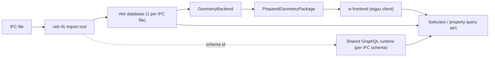

# Velr / IFC Integration for `w`

## Purpose

This note locks the first real external-data architecture for `w`.

The core decision is simple:

- `velr` is the persistent data authority
- `velr-ifc` is the import/export and schema-generation toolchain
- `w` is the geometry-processing and rendering stack that reads from Velr, prepares render packages, and presents them in native and web clients

For now, we are optimizing for a clean backend/frontend split, a stable import pipeline, and a path to real IFC ingestion without dragging browser deployment into backend concerns.

## System Roles

### `velr-ifc`

`velr-ifc` is not the renderer and it is not the long-lived geometry server.

Its role in this architecture is:

- provide IFC import/export tools
- generate and own the IFC GraphQL/runtime schema artifacts
- serve as the source of curated IFC test fixtures

For the first integration slice, `velr-ifc` should be treated primarily as an external toolchain invoked out of process.

That means:

- import should run as a separate binary process
- schema/runtime assets should be copied or referenced as import artifacts
- `w` should not depend on `velr-ifc` as an always-on in-process runtime library for the MVP path

### `velr`

`velr` is the backend-side graph database runtime and storage engine.

Its role is:

- persist imported IFC data
- act as the single source of truth for topology references, identities, relationships, and property data
- support direct backend-side graph reads for geometry extraction hot paths

For now, we assume one Velr database per IFC file.

### `velr-graphql`

`velr-graphql` is the semantic query surface over Velr.

Its role is:

- property lookup
- selection drill-down
- hierarchy exploration
- search, filtering, and semantic inspection

This should be the main path for user-facing metadata access. It is not the preferred path for every geometry hot loop.

### `w` backend

The `w` backend is the geometry-processing layer that sits on top of Velr.

In naming terms already used in this repo:

- `GeometryBackend`: in-process Rust library/orchestrator
- `GeometryServer`: future service/process that hosts `GeometryBackend`

Its role is:

- open or connect to a model-specific Velr database
- query representation data and placement data
- lower source data into `w` generic primitives
- perform tessellation / triangulation / future boolean or healing steps
- emit prepared geometry packages for frontend use
- broker metadata queries back to Velr / GraphQL for selection and inspection workflows

### `w` frontend

The frontend remains thin.

Its role is:

- request prepared geometry packages
- keep a runtime scene projection
- upload and render using `wgpu`
- map user interaction back to backend entity identities

The web frontend should not embed Velr, run IFC import, or own heavy geometry processing.

## First Operating Model

### One database per IFC file

For the first production-shaped slice, use one Velr database per IFC file.

Why:

- operationally simple
- easy to reason about import lifecycle
- easy to cache, rebuild, and delete
- matches the current desire to keep import isolated and stable

We can revisit federation or multi-model composition later.

### Import runs out of process

Import should be launched as a standalone tool invocation, not hidden as a long-lived in-process library call inside the geometry server.

Reasons:

- importer crashes should not take down the serving process
- resource usage is easier to isolate
- the tool boundary keeps `velr-ifc` ownership clear
- it aligns with future batch import and reimport workflows

### Backend owns both geometry extraction and metadata brokering

The frontend should talk to `w` backend interfaces, not directly to Velr or GraphQL in the normal web path.

That keeps:

- authentication and deployment simpler
- query policies centralized
- backend-side batching and caching possible
- browser/runtime dependencies small

## Query Split

We should intentionally use two different backend query styles.

### GraphQL path

Use `velr-graphql` for:

- property panels
- object inspection
- semantic tree browsing
- selection drill-down
- search and filtering

### Direct Velr / OpenCypher path

Use direct backend-side Velr graph reads for:

- coarse geometry extraction
- representation walking
- placement-chain traversal
- bulk instance/package preparation

This path should prefer coarse batched reads over thousands of tiny calls.

Current reason for caution:

- the local Velr notes already show a repeated raw-read memory-growth concern for very fine-grained access patterns

So the rule should be:

- batch geometry reads at useful graph cut points
- do not build the geometry extractor around per-node `exec_one` style loops

## GraphQL Alignment Note

The earlier `node_property.value` failure turned out to be a version-alignment problem in a skewed
local Velr stack, not a confirmed defect in the current `velr-ifc` import/runtime path.

With aligned local `velr`, `velr-graphql`, and `velr-ifc`, and after reimporting databases created
under the old skewed stack, the `cc-w-velr` GraphQL smoke path succeeds again.

The incident notes and reimport guidance are captured in
[`docs/velr-ifc-graphql-repro-memo.md`](/Users/tomas/cartesian/codex/cc-renderer-w/docs/velr-ifc-graphql-repro-memo.md).

## Current Extraction Status

As of 2026-04-20, the first real Velr-backed body extraction path is live in
`cc-w-velr`.

What works now:

- `cc-w-velr` can open an imported model artifact bundle and build a backend
  `PreparedGeometryPackage` directly from Velr data
- `Body` `IfcTriangulatedFaceSet` items lower into generic
  `GeometryPrimitive::Tessellated`
- `Body` `IfcExtrudedAreaSolid` items with `IfcArbitraryClosedProfileDef ->
  IfcPolyline` lower into generic `GeometryPrimitive::SweptSolid`
- source coordinates are currently treated as right-handed `w`-aligned,
  millimeter-space input and normalized into internal meter-space world units
- degenerate zero-area tessellated faces are dropped during extraction so a
  single bad imported triangle does not poison the full package build

Verified fixture:

- `building-architecture`
  - `definitions: 12`
  - `instances: 12`
  - `triangles: 331`

Current limits of this first slice:

- `IfcMappedItem` reuse is not wired into the Velr extraction path yet
- `IfcPolygonalFaceSet`, `IfcRevolvedAreaSolid`, and `IfcSweptDiskSolid` still
  need backend extraction from Velr
- profile holes / voided swept profiles are not part of this first extractor
- only the narrow polyline-based extruded-profile path is enabled right now
- the current fixture path filters helper-marker `IfcBuildingElementProxy` bodies
  named `origin` and `geo-reference` out of the render package so they do not
  pollute fit-camera framing

The current verification entrypoint is:

```bash
cargo run -p cc-w-velr --bin cc-w-velr-tool -- body-summary --model building-architecture
```

Placement audit entrypoint:

```bash
cargo run -p cc-w-velr --bin cc-w-velr-tool -- placement-summary --model building-architecture
```

Current `building-architecture` audit result:

- `local_placements: 22`
- `placements_with_relative_placement: 22`
- `placements_missing_relative_placement: 0`
- `placements_with_parent: 19`

The regenerated import artifacts and the live Velr graph now both contain the
expected `RELATIVE_PLACEMENT` edges for `IfcLocalPlacement`. That clears the
earlier placement blocker: `cc-w-velr` can now resolve local placement chains
against the imported graph contract instead of falling back to identity because
the edge is missing.

See also:
`/Users/tomas/cartesian/codex/cc-renderer-w/docs/velr-ifc-relative-placement-memo.md`
for the historical failure memo.

## Local IFC Render Smoke

The local native/headless runtime now accepts imported IFC models as normal
resources using:

```text
ifc/<model-slug>
```

Current verified example:

```text
ifc/building-architecture
```

Manual smoke entrypoints:

```bash
just ifc-headless-render model="building-architecture" output="/tmp/cc-w-ifc.png"
just ifc-native-viewer model="building-architecture"
cargo run -p cc-w-velr --bin cc-w-velr-tool -- body-instances --model building-architecture
```

This is intentionally a local/dev bridge only. The web viewer still stays on
demo resources for now because the production web path should consume prepared
packages from a backend/service boundary instead of opening the local Velr
database directly from the browser client.

## Identity and Selection Model

Prepared render packages must carry stable source identities.

At minimum, each prepared definition or instance should preserve:

- a stable external entity reference from Velr/import
- enough identity to route a click or selection back to metadata queries

What we should avoid:

- transient draw indices as the only identity
- frontend-only IDs with no backend mapping
- raw internal storage positions if they are not guaranteed stable enough for long-lived selection links

The exact identity field can be finalized during implementation, but the architecture should assume that renderables carry backend-facing source IDs from the start.

## Recommended Artifact Layout

```text
artifacts/ifc/<model-slug>/
  source.ifc
  model.velr.db
  import/
    import-log.txt
    import-metrics.json
  geometry/
    prepared-package.json
    mesh-cache/

artifacts/ifc/_graphql/<ifc-schema>/
  ifc-runtime.graphql
  ifc-runtime.mapping.json
  handoff-manifest.json
```

Notes:

- the database is the durable truth
- GraphQL runtime assets are shared per IFC schema, not copied into each model
- prepared geometry is disposable cache output and may be regenerated

## End-to-End Runtime Shape



## Fixture Policy

We keep a curated repo-local mirror of the local `velr-ifc/testdata` samples we want to use for import, query, and rendering validation.

Current curated set:

- `Building-Architecture.ifc`
- `Building-Hvac.ifc`
- `Building-Landscaping.ifc`
- `Building-Structural.ifc`
- `Infra-Bridge.ifc`
- `Infra-Landscaping.ifc`
- `Infra-Plumbing.ifc`
- `Infra-Rail.ifc`
- `Infra-Road.ifc`
- `20210219Architecture.ifc` from `testdata/buildingSMART/IFC4X3_ADD2/openifcmodel`
- `20201030AC20-FZK-Haus.ifc`

Rules:

- keep provenance clear so we know they came from `velr-ifc/testdata`
- prefer a repo-local fixture mirror or sync recipe over ad hoc absolute paths in tests
- build smoke tests around the smaller files first, then broaden to the heavier corpus

## Parallel Implementation Plan

The work naturally breaks into seven lanes.

### Lane 1: fixtures and import conventions

Scope:

- create a repo-local fixture location for the curated small IFC files
- document or script how those fixtures are synced from `velr-ifc/testdata`
- define the per-model artifact layout for imported databases and runtime assets

Done when:

- one small IFC fixture can be referenced from this repo without hard-coded personal paths

### Lane 2: backend dependency boundary

Scope:

- add backend-only dependency wiring for local release builds of `velr` and `velr-graphql`
- keep those dependencies out of frontend/web crates
- decide whether this lands inside `cc-w-db` or a new dedicated integration crate

Done when:

- backend code can open an existing Velr DB and fetch basic model metadata

### Lane 3: external import orchestration

Scope:

- add a `w`-side import wrapper command or recipe that invokes the `velr-ifc` binary
- write imported DB and runtime artifacts into the agreed artifact layout
- keep import as a separate process boundary

Done when:

- one command imports one small IFC file into one Velr DB plus runtime assets

### Lane 4: semantic query surface

Scope:

- load the GraphQL/runtime assets produced by `velr-ifc`
- stand up a backend-side query surface using `velr-graphql`
- prove simple element, property, and hierarchy queries

Done when:

- a selected backend entity can round-trip into readable property data

### Lane 5: geometry extraction

Scope:

- build coarse batched graph queries for representation and placement extraction
- lower those results into `w` generic primitives
- start with the RV-relevant primitive families already in scope

Done when:

- the backend can produce generic primitive collections from a real imported IFC sample

### Lane 6: prepared package and identity threading

Scope:

- thread stable backend entity references through prepared definitions and instances
- keep model matrices and material color in the prepared/runtime path
- make selection mapping from render instance back to source entity explicit

Done when:

- the frontend can render a real imported package and identify which backend entity an instance came from

### Lane 7: end-to-end validation

Scope:

- add headless/native/web smoke paths over the imported-model flow
- add one or two human-visual verification targets
- add at least one metadata round-trip assertion alongside geometry rendering

Done when:

- a curated IFC fixture imports, renders, and answers at least one property query end to end

## Dependency Order

These lanes do not need to run serially.

Parallel start:

- Lane 1
- Lane 2
- Lane 3
- Lane 4

Follow after first base is in place:

- Lane 5 depends on Lane 2 and an imported DB from Lane 3
- Lane 6 can start once the identity shape is agreed and package threading is ready
- Lane 7 integrates the outputs of Lanes 3 through 6

## Suggested Milestones

### M0: repo and fixture readiness

- fixture policy documented
- artifact layout fixed
- import wrapper direction agreed

### M1: open and query existing Velr data

- backend can open a Velr DB
- GraphQL queries return model metadata and basic properties

### M2: import a small IFC through the `w` flow

- `w` can invoke the external import path and materialize a model-local artifact directory

### M3: semantic selection loop

- frontend/backend selection can resolve to property data through the new query path

### M4: geometry extraction loop

- real imported IFC data lowers into `w` generic primitives and prepared packages

### M5: first real IFC render slice

- at least one curated IFC fixture renders through the normal backend/frontend path and can answer property lookups

## Explicit Non-Goals for This Slice

- no browser-side IFC import
- no browser-side Velr runtime
- no attempt to merge many IFC files into one Velr DB yet
- no large-fixture first pass
- no coupling of frontend crates to Velr dependencies
- no assumption that GraphQL is the fastest path for geometry extraction

## Decision Summary

If we keep this boundary clean, the architecture becomes easier to scale:

- `velr-ifc` owns import and schema generation
- `velr` owns persisted model truth
- `velr-graphql` owns semantic query execution
- `GeometryBackend` / `GeometryServer` own geometry extraction and package generation
- the frontend stays a thin `wgpu` client

That is the shape we should now treat as the default path for real IFC integration.
